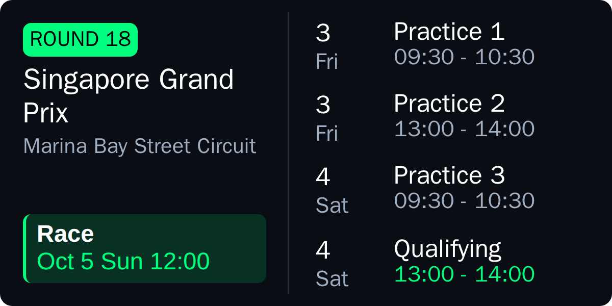
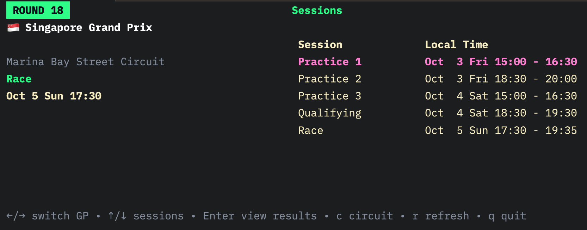
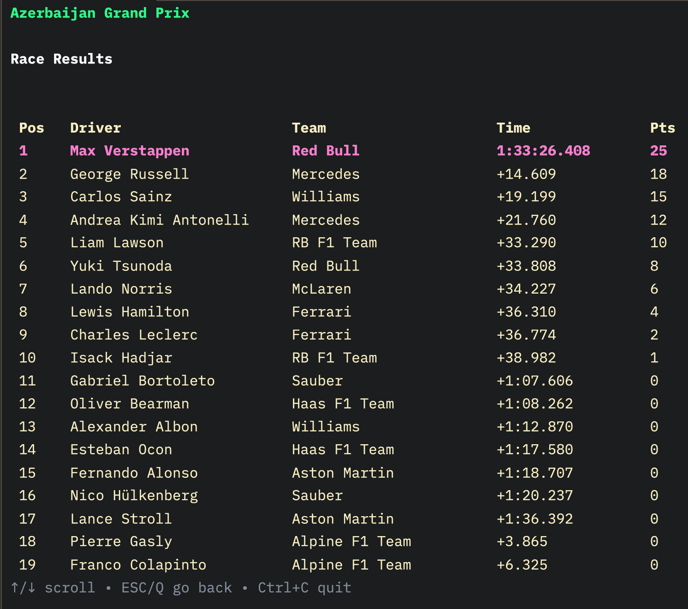
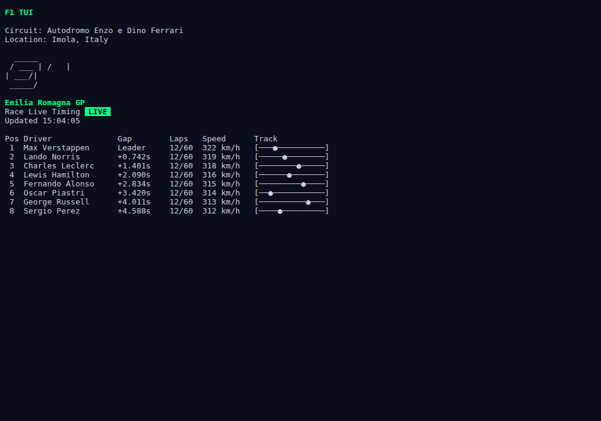

# 🏎️ **F1 TUI**

F1 TUI is a terminal-based application providing a rich interactive user interface to view the current Formula 1 season schedule, session details, and race results. It features live race position updates also!

---

## Inspiration
> Saw [this post](https://playground.nothing.tech/detail/app/cwa3GQYwpgSbVF3j) on Nothing's community playground, which sparked this idea!



---

## Features

- Displays current season race calendar with local session start and end times.
- Session list per GP showing Practice, Qualifying, Sprint, and Race events.
- Detailed session results including driver position, team, time, status, and points.
- Live race leaderboard refreshes every 5 seconds during live races.
- Includes a built-in simulation script to preview live timing without waiting for race day.
- Keyboard shortcuts:
  - `←/→` Switch between different GPs (race rounds)
  - `↑/↓` Navigate session list or scroll results
  - `Enter` Show results for the selected session
  - `c` Toggle circuit ASCII art
  - `r` Refresh race schedule and results
  - `q` or `Ctrl+C` Quit the application
  - `ESC` or `Backspace` Go back from results view

---

## Download

Get the compiled binaries from [releases page](https://github.com/kashifulhaque/f1-tui/releases)

---

## Installation

Ensure you have Go 1.20+ installed. Clone the repo and use `go run` to start:

```
git clone https://github.com/kashifulhaque/f1-tui.git
cd f1-tui
go run .
```

---

## Simulate a Race

Use the simulation script to preview the live timing UI with deterministic local data:

```
go run ./scripts/simulate_race.go
```

The app will start in a simulated live race view (with the circuit diagram enabled). Press `ESC` to return to the schedule or `c` to toggle the circuit illustration.

---

## Screenshots

### Main Schedule View with Flags and Sessions



### Detailed Race Results with Points



### Simulated Live Timing View



---

## Code Structure

- `main.go` — Entry point, starts the TUI program.
- `internal/api/ergast.go` — Interacts with the Ergast F1 API for schedule and session data.
- `internal/models/types.go` — Data models for races, sessions, and driver results.
- `internal/ui/` — UI components including model, view, update, styles, and commands.
- `internal/utils/` — Utility functions including flag emoji generation and time parsing.

---

## Contribution

Contributions are welcome! Feel free to submit issues or pull requests to enhance functionality or improve UX.

---

## Release

To create a release:
```shell
git tag v1.0.0
git push origin v1.0.0
```

---

## License

MIT License © 2025
